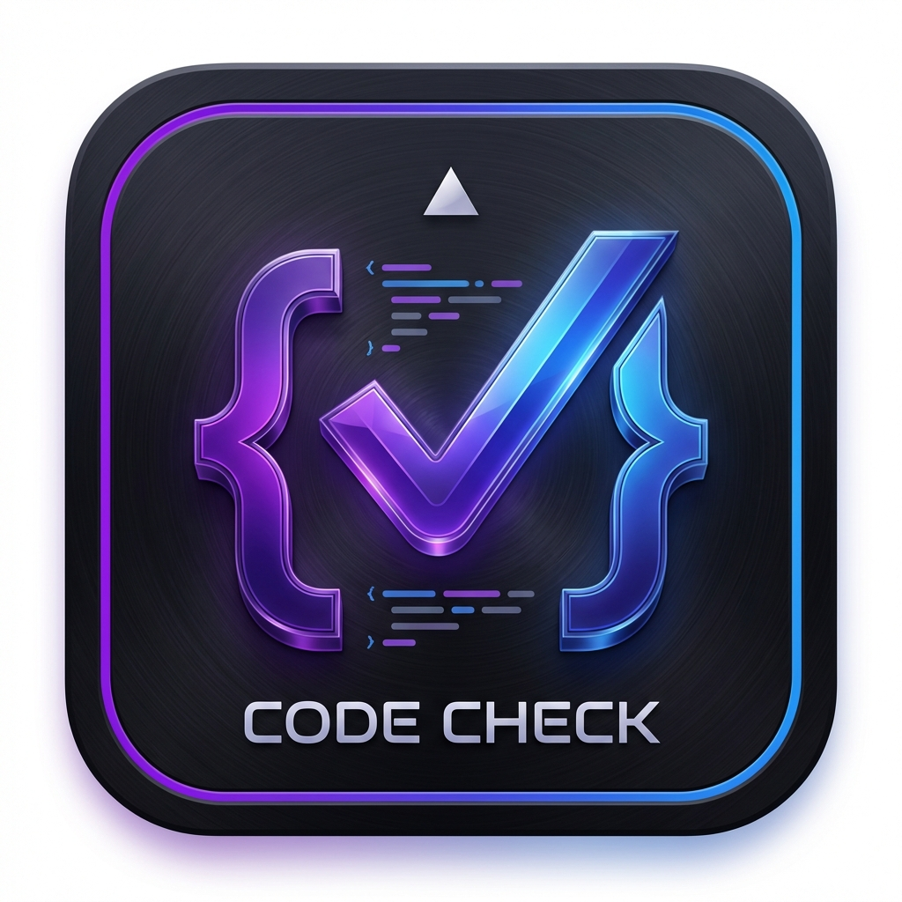
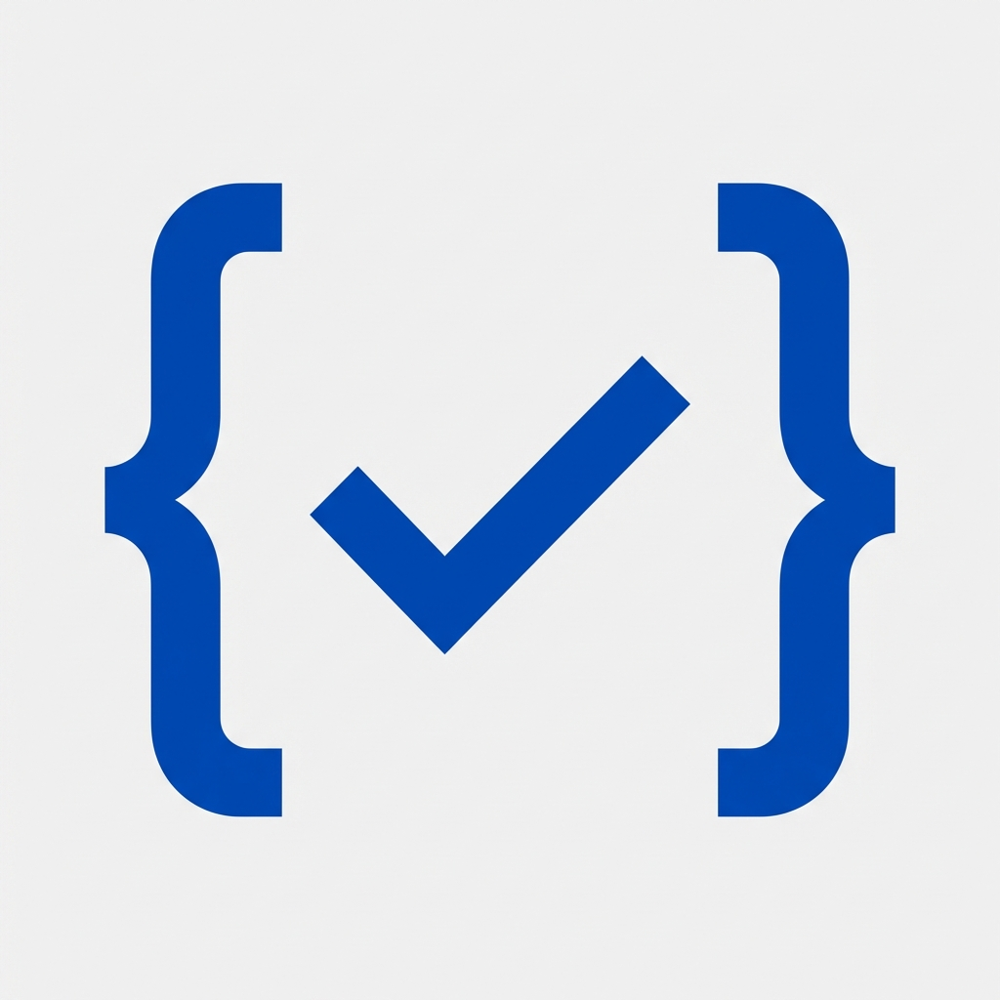
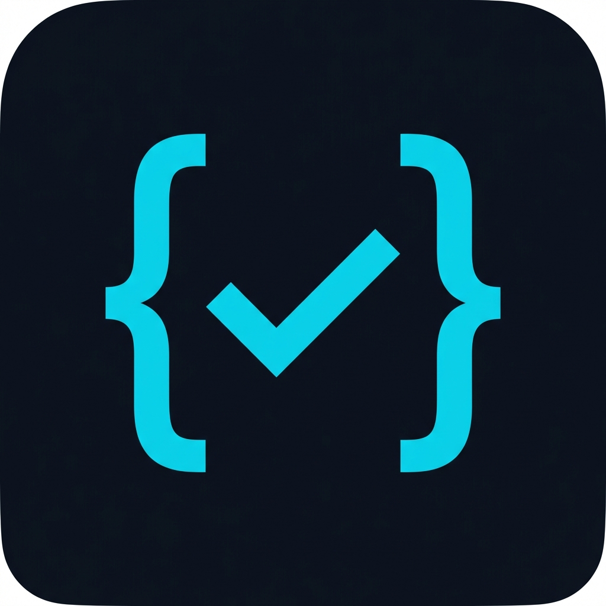

# 图标设计提示词记录

本文档记录了 UniVal 图标设计过程中使用的所有文生图提示词，供学习参考。

---

## 版本 1 - 基础简约风格

**效果**：蓝绿渐变线条，文件+对勾图标，浅色背景


```
A minimalist app icon for a file validator tool called "UniVal". The icon should feature a simple document or file symbol with a checkmark, representing validation/verification. Use a modern gradient color scheme with blue and green tones (representing success/valid). Clean geometric shapes, flat design style, suitable for desktop application icon. Square format with rounded corners, white or light background. No text, pure iconographic design.
```

**评价**：太普通，不够极客

---

## 版本 2 - 极客科技风

**效果**：深色背景、花括号包围对勾、紫蓝渐变、霓虹光效、有文字



```
A premium, geeky app icon for a code/config file validator tool. Design inspired by VS Code, Figma, and Vercel aesthetics. Features abstract curly braces {} or angle brackets merged with a subtle checkmark, creating a unique geometric symbol. Use a bold gradient from deep purple to electric blue with subtle glow effects. 3D depth with glassmorphism or metallic sheen. Dark background with vibrant accent colors. Ultra-modern, developer-focused, Silicon Valley tech startup vibe. App icon format, square with rounded corners.
```

**评价**：布局不错但太花哨，渐变色浮夸，有多余的文字和装饰

---

## 版本 3 - 极简纯色

**效果**：浅色背景、深蓝色纯色、左花括号+对勾


```
Minimalist app icon, pure geometric design. A stylized curly brace symbol { merged with a checkmark forming a single unified logo mark. Solid single color - choose either: deep blue (#0066FF), or teal (#00A67E), or purple (#7C3AED). Pure flat design, no gradients, no shadows, no borders, no decorations, no text. White or very light gray background. Clean like Notion, Slack, VS Code, Figma app icons. Simple, bold, iconic, instantly recognizable silhouette. Square format.
```

**评价**：太普通，右边太空

---

## 版本 4 - 对称布局（失败）

**效果**：浅色背景、{✓} 对称布局但不够美观



```
Minimalist app icon. Centered symmetric design: left curly brace { on left side, a bold checkmark in the center, right curly brace } on right side, forming a balanced composition like { ✓ }. All elements in solid single deep blue color (#0052CC or similar). Pure flat design, no gradients, no shadows, no borders, no text, no decorations. Light gray or white background. Clean geometric shapes, thick consistent stroke weight. Inspired by VS Code, Atlassian, JetBrains icon style. Square format, elements centered and well-spaced.
```

**评价**：不如第二版直接精简好看

---

## 版本 5 - 深色背景纯色（推荐）

**效果**：深色背景、青色图标、{✓} 布局、简洁无装饰



```
App icon with dark background (#1a1a2e or #0d1117). Centered design featuring curly braces { } with a checkmark inside, similar to {✓}. The braces frame the checkmark elegantly. Use solid single color for the symbol - either white, or bright teal (#00D9FF), or electric blue (#3B82F6). No gradients, no glow effects, no text, no borders, no extra decorations, no triangles. Clean bold geometric shapes, consistent line weight. Minimal like GitHub, Vercel, Linear app icons. Square format with subtle rounded corners.
```

**评价**：好多了！结合了布局优点和简洁风格

---

## 版本 6 - 最终版（填满画布）

**效果**：深色背景填满画布、青色图标、{✓} 布局、无需透明背景


```
App icon that fills the entire canvas edge to edge. Dark background (#0d1117 or #1a1a2e) with rounded corners filling the whole square. Centered design: curly braces { } with a checkmark inside {✓}. Use solid cyan/teal color (#00D9FF) for the symbol. No white space around edges, the dark rounded rectangle IS the icon boundary. No gradients, no glow, no text, no borders, no decorations. Clean minimal design like GitHub, Vercel icons. The icon background should touch all four edges of the image.
```

**评价**：✅ 最终采用版本

---

## 提示词技巧总结

### 1. 明确指定不要的元素
使用否定词明确排除不想要的效果：
- `No gradients` - 不要渐变
- `No text` - 不要文字
- `No borders` - 不要边框
- `No decorations` - 不要装饰

### 2. 使用具体的颜色代码
指定 HEX 颜色值更精准：
- `#0d1117` - GitHub 深色背景
- `#00D9FF` - 亮青色
- `#0052CC` - Atlassian 蓝

### 3. 参考知名品牌风格
提及大厂设计风格作为参考：
- `like GitHub, Vercel, Linear app icons`
- `Inspired by VS Code, Figma`

### 4. 描述布局结构
清晰描述元素位置关系：
- `Centered design`
- `fills the entire canvas edge to edge`
- `The braces frame the checkmark`

### 5. 强调设计原则
使用设计术语：
- `Minimalist` - 极简
- `Flat design` - 扁平设计
- `Geometric shapes` - 几何形状
- `Consistent line weight` - 一致的线条粗细
